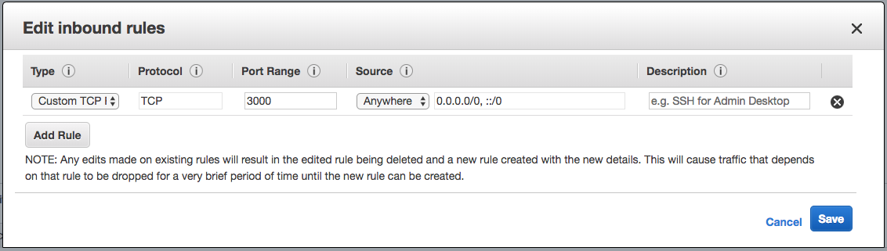

# HackerNews project - Group 7

[](https://circleci.com/gh/edipetres/HackerNewsG7)

[](http://hackernews-group7.s3-website.eu-central-1.amazonaws.com/#/)


## Table of Contents  
[Group members](#group-members)  
[How to run the project](#how-to-run-the-project)
[Tool stack](#tool-stack)  
[CI/CD pipeline](#ci/cd-pipeline)  
[Deployment](#deployment)
[Database schema](#database-schema)  

## Group members

| Member     | Email address            |
|------------|--------------------------|
| Plamen     | plamengetsov95@gmail.com |
| Florent    | kryptag@gmail.com        |
| Edmond     | edipetres@gmail.com      |
| Emil       | emilklausen2@hotmail.com |
| Zygimantas | pr.zygimantas@gmail.com  |

## How to run the project

### Install dependencies

```sh
npm install
```

### Compiles and hot-reloads for development (back and frontend)

```sh
npm start
```

<details>
<summary>Other Commands</summary>

### Compiles and minifies for production

```sh
npm run build
```

### Run your tests

```sh
npm run test
```

### Lints and fixes files

```sh
npm run lint
```

### Run your end-to-end tests

```sh
npm run test:e2e
```

### Run your unit tests

```sh
npm run test:unit
```

</details>


## Tool stack

| Service         | Tool                   | Comment                                           |
|-----------------|------------------------|---------------------------------------------------|
| Frontend        | Vue.js                 |                                                   |
| Backend         | Node.js, Express.js |                                                   |
| CI/CD pipeline  | CircleCI               | https://circleci.com/gh/edipetres/HackerNewsG7    |
| Version Control | Github                 | https://github.com/edipetres/HackerNewsG7         |
| Deployment      | Digital Ocean          | Both back and front-end lives in the same project |
| Database        | Mongodb                | https://mlab.com/                                 |

## CI/CD pipeline

See pipeline in CircleCI [here](https://circleci.com/gh/edipetres/HackerNewsG7)

Find the pipeline configuration file [here](.circleci/config.yml)

1. [x] Checkout code from Github
2. [ ] Run tests
3. [x] Build production code
4. [x] Deploy frontend to AWS S3
5. [x] Deploy backend API to AWS ElasticBeanstalk
6. [ ] Release version on Github? - we haven't decided if we want to do this manually, or to be part of the pipeline.

### Environment variables

Set these environment variables in the CircleCI pipeline settings

| Key | Value |
|-|-|
| AWS_ACCESS_KEY_ID | xxxxAVCQ|
| AWS_SECRET_ACCESS_KEY | xxxxnnLR |
| S3_BUCKET_NAME | xxxxoup7 |

## Deployment

Both our back and frontend code lives in this project, but they are deployed to separate AWS services.

### Frontend

After the CI chain builds the static frontend files it uploads them to an S3 bucket. This bucket is configured for Static Website Hosting. It does that by serving the `index.html` file at the root of the bucket.

Public endpoint for the frontend: http://hackernews-group7.s3-website.eu-central-1.amazonaws.com/

#### Note

It is important to add the following Policy to the bucket to allow public access to all files - this way everyone on the internet can access our website. Without this policy you will get a `403 Access Forbidden` error when navigating to the URL endpoint.

```json
{
  "Version": "2012-10-17",
  "Statement": [{
    "Sid": "PublicReadGetObject",
    "Effect": "Allow",
    "Principal": "*",
    "Action": "s3:GetObject",
    "Resource": "arn:aws:s3:::hackernews-group7/*"
  }]
}
```

### Backend

Express.js powers our backend API which is deployed to Elastic Beanstalk.

First we manually created an application on EB and a Node.js environment. Using the aws-cli tool we configured the project locally to deploy to this environment (using `eb init`) - this configuration can be found [here](.elasticbeanstalk/config.yml). We commit this configuration file which allows the CI chain to know where to deploy the app when running the `eb deploy` command.

Public IP for our backend API: http://52.28.201.249:3000/

#### Note

It is important to allow all inbound traffic to the server, otherwise our request will time out. You can do that manually by navigating to the EC2 instance the ElasticBeanstalk environment created for us and edit the attached Security Group: add a custom TCP rule to inboud traffic on port 3000 (the port your API server is listening on) and allow all traffic (`0.0.0.0/0, ::/0`). See image below.



## Database schema

We drafted the following sketch for the database schema for our MongoDB.

To-do:
1. Add `title` to Post schema DB object


