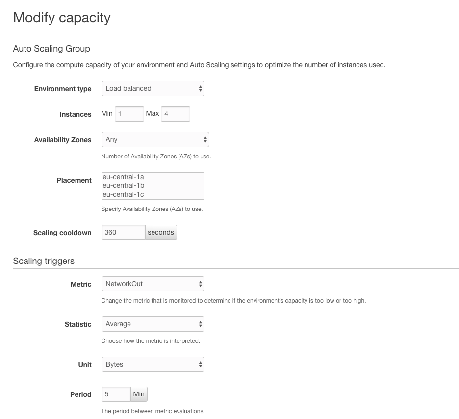
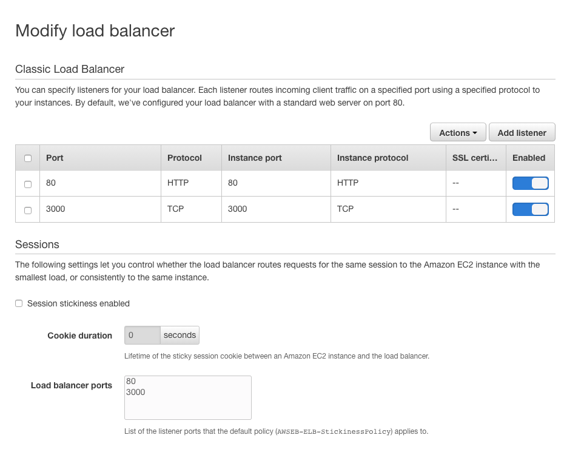

# DevOps and Scaling

As our app is deployed to Elastic Beanstalk, the most obvious decision for our setup was to enable Load Balancing and Auto Scaling for the environment.

## Setting up

Load balancing comes hand in hand with auto scaling. First we have to set the environment type to load balancing. In the background, this will create a load balancer that sits between the incoming newtwork proxy (what takes the request) and the instances that respond to the request itself. We chose a maximum of 4 instances in case of an increased incoming network traffic. In the configurator we can also set multiple configurations, like where do we want these servers to be, how long should they be running on a low traffic before cooling down again, what metrics do we want to attach the scaling triggers etc.

In order to forward the request from the proxy to our API server (more about the proxy server below) we have to open up the ports our Node.js server is using. Since we are sending HTTP requests to port 3000 for our API, we had to allow the TCP protocol on port 3000 to be routed to the corresponding instance protocol.

## Challanges

A nginx proxy server is sitting in front of our Instance Server. This proxy is forwarding request to our instance and meanwhile logging the incoming requests to expose them like Prometheus exposes the `/metrics`. 

Due to an error in the way nginx creates these logs, after tens of hours of debugging we could not solve the issue for these log files to be created for our environment. There seems to be a problem with the so called `Health Agent (healthd cli)` Amazon is using to create the log files from nginx. It might be due to how nginx is deployed with a multicontainer setup.

This proxy server has also caused us issues enabling autoscaling and load balancing, but within a few hours we could indentify the problem in the configuration and successfully enable scaling that now manages up to 4 instances whenever traffic increases to our website and scales them down accordingly after certain inactivity.